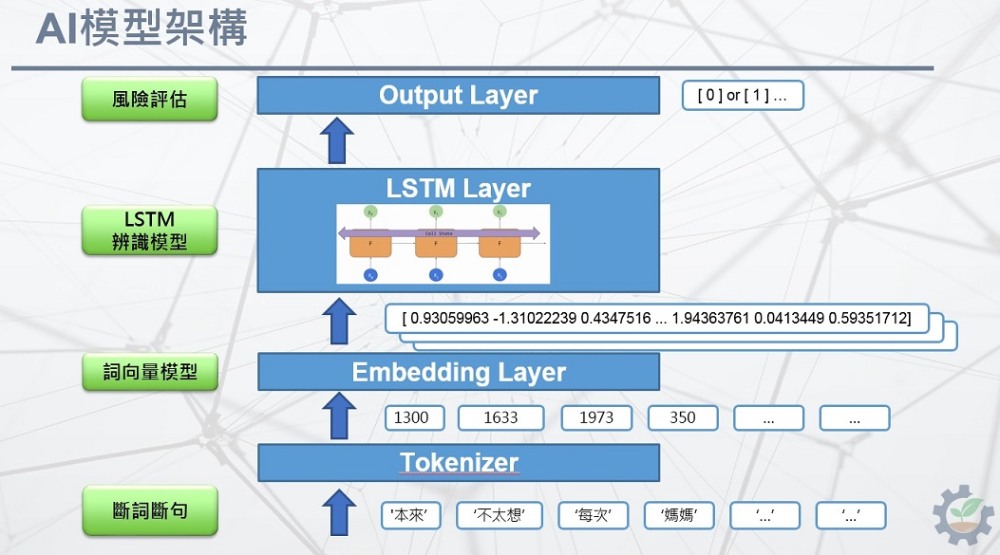

## 簡介
此自殺風險評估model可將自殺留言分類為低風險、中風險、高風險三類。  
### 1 train_with_pretrained_embedding.ipynb
此範例使用pre-trained好的詞向量在embedding層，並做分類。  
### 2 prepare_danger_words.ipynb
此範例將自殺危險因子存成pickle檔，方便之後使用。  
### 3 train_with_data_augmentation.ipynb
此範例說明如何做NLP的Data Augmentation，包含Random Insertion、Random Swap、Random Deletion。再將做過Data Augmentation的資料拿來訓練，使用pre-trained好的詞向量在embedding層，並做分類。  
### 4 BERT_TF_Hub.ipynb
此範例使用BERT來訓練分類任務，使用pre-trained好的中文model[4]。  

## 系統架構
如下圖包含(1) 斷詞斷句、(2) 詞向量模型、(3) LSTM模型、 (4) 風險評估。  
  

## References
[1] Jieba斷詞斷句： https://github.com/fxsjy/jieba  
[2] Gensim word2vec： https://radimrehurek.com/gensim/models/word2vec.html  
[3] NLP data data augmentation: https://www.aclweb.org/anthology/D19-1670.pdf  
[4] https://tfhub.dev/google/bert_chinese_L-12_H-768_A-12/1  
